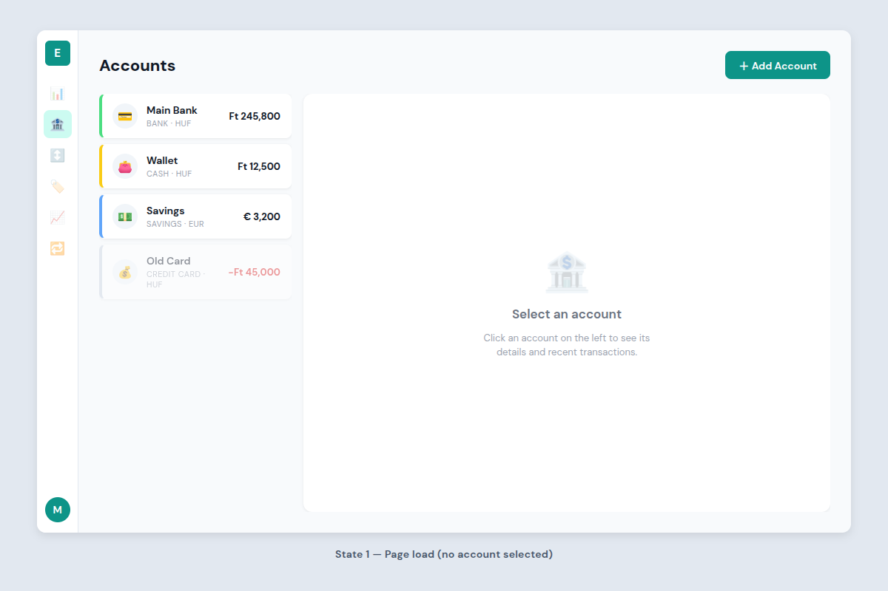
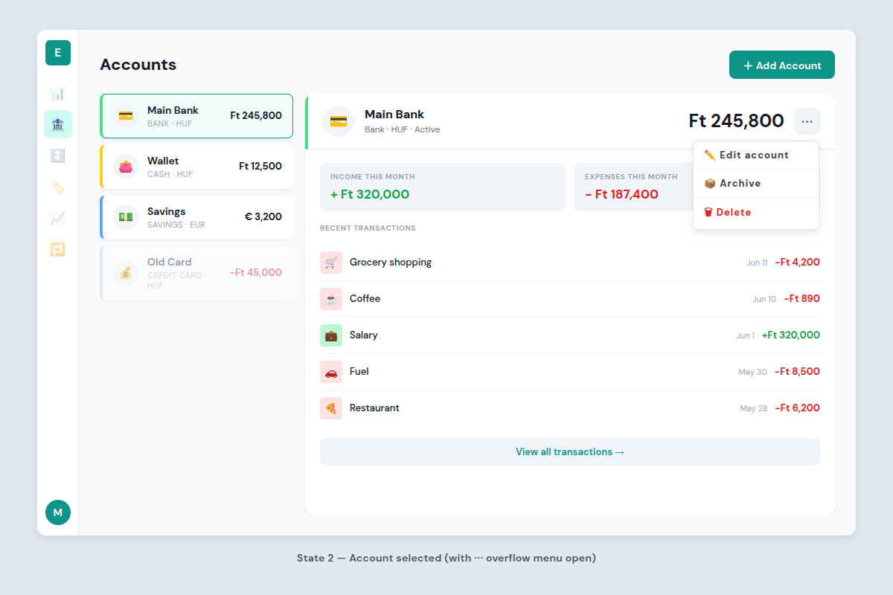

# Accounts Page Design

**Date:** 2026-06-13
**Status:** Approved
**Scope:** Layout, interactions, and component structure for the `/accounts` page.

---

## Context

The accounts page is where users view and manage their financial accounts (cash, bank, credit card, savings, etc.). It needs to show all accounts at a glance while allowing quick access to per-account details and recent transactions without navigating away.

---

## Layout Mockups

**State 1 — Page load (no account selected)**


**State 2 — Account selected (with ⋯ overflow menu open)**


---

## Layout — Master-Detail

The page uses a two-panel master-detail layout inside the existing `ShellComponent`.

```
┌─ Page header ──────────────────────────────────────────────┐
│  "Accounts"                          [＋ Add Account]       │
└────────────────────────────────────────────────────────────┘
┌─ Left panel (260px) ──┐  ┌─ Detail panel (flex: 1) ───────┐
│  Account list          │  │  Empty state  /  Account detail │
│  (scrollable)          │  │                                 │
└───────────────────────┘  └─────────────────────────────────┘
```

---

## Left Panel — Account List

A scrollable list of account items. Each item is a card with:

- **Left accent stripe** (4px wide) in the account's chosen color
- **Neutral icon circle** (34×34px, `$color-bg-muted` background) with the account emoji/icon
- **Account name** (14px/600) and **type · currency** label below (11px uppercase, muted)
- **Balance** right-aligned (13px/700)
- Selected state: teal border (`$color-primary`) on all sides + `$color-primary-faint` background
- Archived accounts: same structure but `opacity: 0.45`, always visible (not hidden)

---

## Detail Panel — Empty State (initial load)

When no account is selected, the detail panel shows a centered placeholder:

- Large bank emoji icon (52px, `opacity: 0.25`)
- Title: "Select an account" (17px/600, `$color-text-secondary`)
- Subtitle: "Click an account on the left to see its details and recent transactions." (13px, muted, max-width 240px, centered)

---

## Detail Panel — Account Selected

### Header

Left border stripe in the account's color (4px, matching the list item). Contains left-to-right:

- **Icon circle** (42px, neutral `$color-bg-muted` background) with emoji
- **Account name** (16px/700) and **type · currency · status** below (12px, `$color-text-secondary`)
- **Current balance** (24px/700, `$color-text-primary`) pushed right via `margin-left: auto`
- **⋯ overflow button** (34×34px, `$color-bg-muted` background, `$radius-md`) — rightmost element

#### Overflow Menu (opens on ⋯ click)

A PrimeNG `p-menu` anchored to the ⋯ button with three items:

| Item | Style |
|------|-------|
| ✏️ Edit account | Normal text |
| 📦 Archive | Normal text |
| 🗑 Delete | Red (`$color-expense`) — danger action |

- **Edit account** → opens the account modal pre-populated with current values
- **Archive** → toggles `isArchived`, dims the item in the list immediately
- **Delete** → shows a PrimeNG `p-confirmDialog` before deleting

### Body

Below the header, `18px 20px` padding, two sections:

**Monthly stats strip** — two equal-width stat boxes (`$color-bg-muted`, `$radius-md`, 12px padding):
- "Income this month" → amount in `$color-income` (green), 17px/700
- "Expenses this month" → amount in `$color-expense` (red), 17px/700

**Recent transactions** — section title ("Recent Transactions", 10px/700 uppercase muted), then a list of the **5 most recent transactions** for this account:
- Each row: category icon box (30×30px, `$radius-sm`, semantic faint background) · description (13px/500) · date (11px muted) · amount (13px/700, income/expense/transfer color)
- Rows separated by `1px solid #f1f5f9`

**"View all transactions →" button** — full width below the transaction list, `$color-bg-muted` background, `$color-primary` text, `$radius-md`, 10px vertical padding. Navigates to `/transactions?accountId=<id>`.

---

## Add / Edit Account — Modal Dialog

Both "＋ Add Account" (page header button) and "Edit account" (overflow menu item) open the **same modal dialog** — edit mode pre-populates all fields with the account's current values.

**Modal title:** "Add Account" / "Edit Account"

**Fields:**

| Field | Component | Notes |
|-------|-----------|-------|
| Name | Text input | Required, max 100 chars |
| Type | Dropdown | CASH, BANK, CREDIT_CARD, SAVINGS, INVESTMENT, OTHER |
| Currency | Dropdown (searchable) | ISO 4217 codes, defaults to user's `homeCurrency` |
| Initial balance | Number input | Defaults to 0; **create mode only** — hidden when editing |
| Color | Color swatch picker | Grid of preset hex colors; selected color previews as a live left-stripe preview |
| Icon | Emoji/icon picker | Grid of preset icons (wallet, card, piggy bank, etc.) |

**Footer buttons:**
- Primary: "Save" (`$color-primary`)
- Secondary: "Cancel" (closes dialog, no changes saved)

Form uses Angular reactive forms (`NonNullableFormBuilder`). Inline error messages appear below invalid fields on submit attempt. Dialog uses `$radius-xl` border-radius and `$shadow-lg`.

---

## Empty Page State (zero accounts)

If the user has no accounts at all, the left panel shows a centered empty state:

- Large 🏦 icon (muted opacity)
- "No accounts yet" (heading)
- "Add your first account to get started." (muted)
- "＋ Add Account" primary button

The detail panel is hidden in this state.

---

## What This Spec Does Not Cover

- Balance history chart per account (deferred — belongs in a future Reports spec)
- Deep-linking to a specific account via URL (can be added later with `?selected=<id>` query param)
- Mobile/responsive layout (desktop-first per project SPEC)
